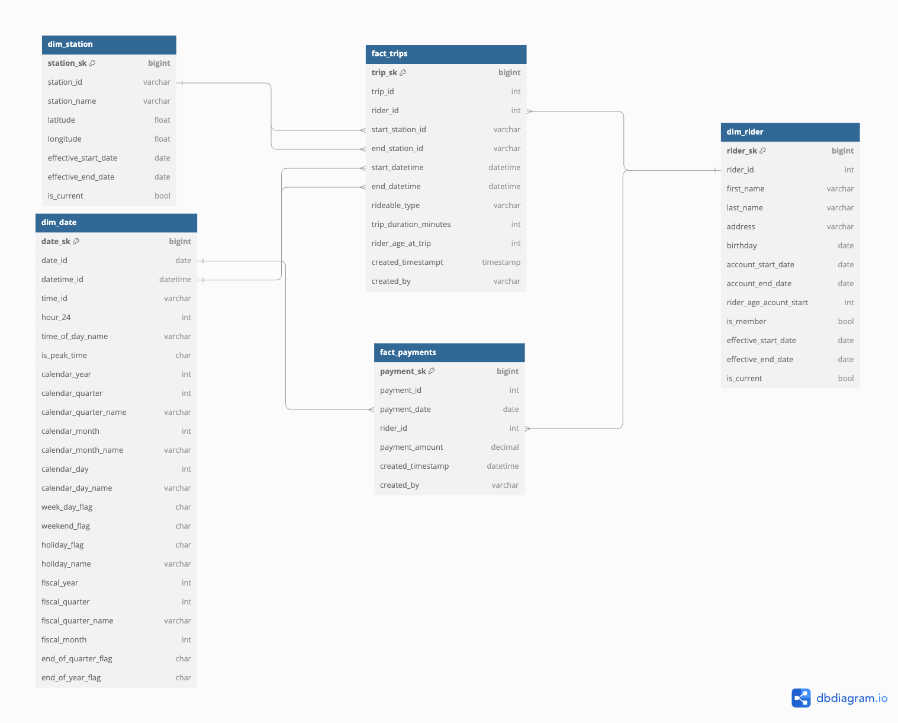

# Data Lakehouse for Divvy Bikeshare with Spark and Azure Databricks

Divvy is a bikeshare service in Chicago. It provides an easy and affordable way to explore the city by renting classic bikes, e-bikes, or scooters via an app. The company offers unlimited 45-minute rides on classic bikes and premium Lyft Pink membership as well as several other programs. More information can be found on their [website](https://divvybikes.com).

As part of Udacity's course on Data Lakes and Lakehouses with Spark and Azure Databricks, we developed a data lakehouse solution for Divvy by setting up an ELT pipeline to extract, load, and transform Divvy's data.

## The business outcomes:
1. Analyze how much time is spent per ride:
   - Based on date and time factors such as day of the week and time of day.
   - Based on which station is the starting and/or ending station.
   - Based on the age of the rider at the time of the ride.
   - Based on whether the rider is a member or a casual rider.
2. Analyze how much money is spent:
   - Per month, quarter, and year.
   - Per member, based on the age of the rider at the account start.
   - Per member, based on how many rides the rider averages per month.
   - Per member, based on how many minutes the rider spends on a bike per month.

## Raw Data

The City of Chicago makes anonymized bike trip data publicly available for projects, which we used in this project as part of the course assignment. Below is more information on the raw dataset:

## Project Steps
1. Develop a dimensional model
2. Ingest raw data into Azure Databricks DBFS
3. Extract Divvy's raw data from CSV files into the delta table storage format with appropriate data schema for each table
4. Transform the data into the star schema data model using Spark and Spark-SQL

## Star Schema Design

The diagram below represents a dimensional model specifically disigned to answer questions related to Divvy's business outcomes.

Please see python code for more details on on how the project steps were implemented. 
